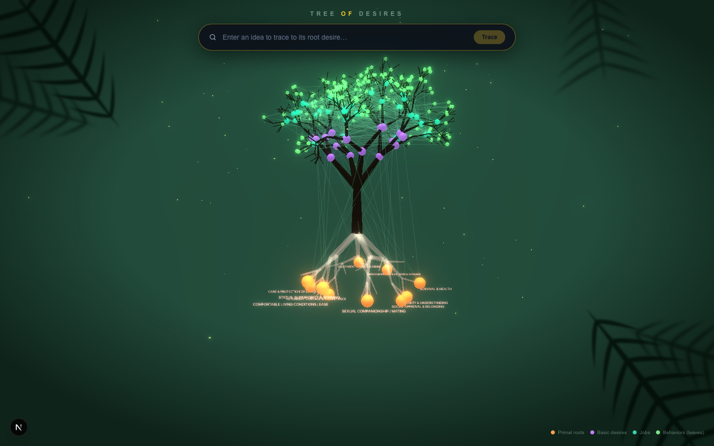
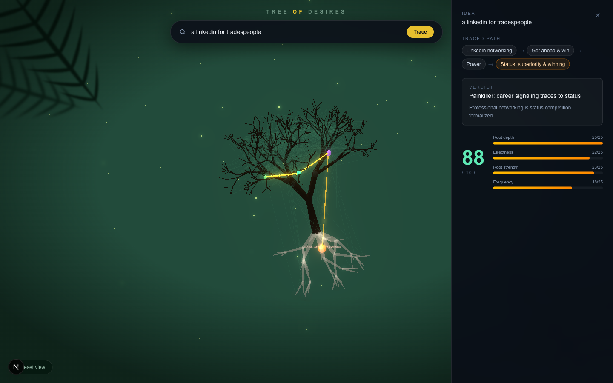

<div align="center">

# 🌳 Tree of Desires

**Trace any product idea to the primal human desire it feeds — or discover that it doesn't.**

[](https://nextjs.org)
[](https://www.typescriptlang.org)
[](https://threejs.org)
[](https://tailwindcss.com)
[](https://openrouter.ai)
[](LICENSE)



</div>

---

**Tree of Desires** is a mental-model and idea-validation tool — not a chatbot. It renders human motivation as a living, procedurally-generated 3D tree: **10 primal desires glow among the roots**, Reiss's **16 basic desires** sit at the trunk forks, **38 functional jobs** line the branches, and **163 observed modern behaviors** form the canopy. Type a startup / product / feature idea into the prompt bar and an AI traces it from the behavior it maps to, down through the branches, to the primal root it ultimately feeds.

The core belief the tool encodes:

> **Ideas that trace cleanly to a primal desire are painkillers. Ideas that don't are vitamins.**

A failed trace — an idea with **no root desire anchor** — is surfaced as a first-class result with a red flag, because it's the most useful signal the tool produces.

<div align="center">

</div>

## ✨ Features

- 🌲 **Procedural 3D tree** — a seeded recursive branching algorithm grows the trunk, branches and a mirrored pale root system; every ontology node is pinned to a sampled point on the skeleton
- 🔦 **Animated idea traces** — the matched path glows gold with flowing particles while the rest of the tree dims to a silhouette; the camera flies to a front-on framing of the path
- 🧠 **Research-grounded ontology** — 227 nodes / 619 edges built on four published frameworks (see [The ontology](#-the-ontology))
- 📊 **Idea validation score** — four 0–25 subscores (root depth, directness, root strength, frequency) sum to a 0–100 verdict
- 🌱 **Novel ideas still get placed** — if no existing behavior matches, the AI proposes a new leaf and grafts it onto the closest functional job
- 🛡️ **Server-side AI only** — the API key never reaches the client; the model's graph claims are re-validated against the real ontology before anything renders
- 🎆 Jungle atmosphere: bloom glow, exponential fog, drifting fireflies, foliage-framed vignette

## 🚀 Getting started

**Prerequisites:** Node.js 18+, an [OpenRouter](https://openrouter.ai/keys) API key.

```bash
git clone https://github.com/sanky369/tree-of-desires.git
cd tree-of-desires
npm install

cp .env.example .env.local        # then paste your key:
# OPENROUTER_API_KEY=sk-or-...

npm run dev                       # → http://localhost:3000
```

## 🕹️ How to use

1. **Explore the tree.** It slowly orbits on its own. Drag to rotate, scroll to zoom, hover any node for its definition and source framework. Ember-orange roots are primal desires; violet spheres are basic desires; teal are jobs-to-be-done; green leaves are modern behaviors.
2. **Trace an idea.** Type it into the prompt bar — e.g. `a smart ring that scores your sleep` — and press Enter. The AI matches it to a behavior, walks parent edges inward, and the path lights up gold from leaf to root.
3. **Read the analysis panel.** Breadcrumb of the traced path, a one-line verdict (*painkiller* vs *vitamin*), a plain-language rationale, four sub-score bars and the big 0–100 number.
4. **Stress-test weak ideas.** Try `a social network for spreadsheets` — the trace stalls before reaching a root and the panel shows a **⚠ No root desire anchor** warning. That's a result, not an error.
5. **Reset view** (bottom-left) clears the highlight, removes any temporary leaf and returns the camera to the idle orbit.

## ⚙️ How it works

```
idea ──► POST /api/trace ──► OpenRouter (gpt-5.4-mini, JSON-schema output)
              │                       │
              │             { matchedBehaviorId, path[], scores… }
              ▼                       ▼
      sanitizePath() ◄────── every hop checked against real edges
              │
              ▼
   3D scene: glow path · dim rest · fly camera · slide in panel
```

1. **The route** ([`app/api/trace/route.ts`](app/api/trace/route.ts)) sends the model the full node list grouped by layer plus the idea, and constrains the reply with **structured outputs** (`response_format: json_schema`) — no prose, no markdown fences by construction. The model id is a single constant (`MODEL`), so any OpenRouter model is a one-line swap.
2. **Zero trust in the model's graph claims.** `sanitizePath()` keeps only the longest prefix of the returned path whose hops are real parent edges in the ontology, then recomputes `reachedRoot` and `rootDesireId`, clamps every subscore to 0–25 and re-sums the total. A hallucinated edge cannot fake a root anchor.
3. **The tree** ([`components/DesireGraph.tsx`](components/DesireGraph.tsx)) is authored, not simulated: a seeded recursive algorithm generates a branch/root skeleton, and each node layer is pinned to its region — primal desires on root tips, basic desires at the lower forks, jobs mid-branch, behaviors on the terminal twigs. [3d-force-graph](https://github.com/vasturiano/3d-force-graph) renders the interactive node web on top, with `UnrealBloomPass` for the glow. Rendered client-side only (`next/dynamic`, `ssr: false`).

### Scoring (4 × 0–25 = 0–100)

| Subscore | Measures |
|---|---|
| **Root depth** | Did the trace terminate cleanly at a Layer-0 root, or stall mid-tree? |
| **Directness** | Short, obvious paths beat convoluted or metaphorical hops |
| **Root strength** | Life-Force 8 roots outrank the two extension roots; 0 if no root reached |
| **Frequency** | How habitual the underlying behavior is (daily habit ≫ rare one-off) |

## 🌳 The ontology

227 nodes / 619 edges in [`data/desires.json`](data/desires.json). Each node is `{ id, label, layer, parents, description, framework }`; edges derive from `parents` (parent → child). It's a **DAG, not a strict tree** — real behaviors are over-determined, so multi-parent links are intentional.

| Layer | Contents | Source |
|---|---|---|
| **0 — Primal roots** (10) | Life-Force 8: survival, food, safety, mating, comfort, kin care, belonging, status — plus two extensions: *curiosity & understanding*, *autonomy, control & competence* | Drew Eric Whitman, *Cashvertising*; cross-checked against Kenrick et al., *Fundamental Social Motives* |
| **1 — Basic desires** (16) | Reiss's 16, names kept exactly: Power, Independence, Curiosity, Acceptance, Order, Saving, Honor, Idealism, Social Contact, Family, Status, Vengeance, Romance, Eating, Physical Activity, Tranquility | Steven Reiss, *Who Am I? The 16 Basic Desires* (empirically factor-derived) |
| **2 — Functional jobs** (38) | Save time, reduce anxiety, look good, belong to a tribe, create & make, earn a living, escape, feel pleasure, choose confidently, guard reputation… | Christensen / Ulwick **Jobs-to-be-Done** (functional · emotional · social triad) |
| **3 — Observed behaviors** (163) | Doomscrolling, sleep tech, AI copilots, status sneakers, gifting, sports fandom, content creation, thrifting, astrology apps… across 20+ life domains | Authors' compilation, coverage-checked against 2025-26 consumer-behavior research |

**Provenance, honestly:** layers 0–1 reproduce published psychology; layer 2 is shaped by the JTBD framework but has no canonical list; layer 3 and *all inter-layer edges* are the authors' interpretive synthesis (the two literatures were never bridged academically). Treat the skeleton as citable and the wiring as a hypothesis — full citations live in the `_meta` block of `desires.json`.

Layer 2 is deliberately the **complete "interface"**: an idea that matches no leaf still anchors at a job via a temporary grafted leaf, so arbitrary idea searches always resolve.

## 📁 Project structure

```
├── app/
│   ├── api/trace/route.ts    # server-only AI trace endpoint (OpenRouter)
│   └── page.tsx              # full-screen scene + prompt bar + panel
├── components/
│   ├── DesireGraph.tsx       # procedural tree, node web, bloom, trace FX
│   ├── PromptBar.tsx
│   └── AnalysisPanel.tsx
├── data/desires.json         # the 227-node ontology (the backbone)
└── lib/desires.ts            # types, edge derivation, path sanitizer
```

## 🔧 Configuration

| What | Where |
|---|---|
| AI model | `MODEL` constant in `app/api/trace/route.ts` — any OpenRouter model id |
| API key | `OPENROUTER_API_KEY` in `.env.local` (server-side only, never bundled) |
| Tree shape | seeded generator in `DesireGraph.tsx` (`buildSkeleton`) — change the seed for a new tree |
| Palette / bloom | constants at the top of `DesireGraph.tsx` |

## 📄 License

[MIT](LICENSE) — use it, fork it, study with it.

---

<div align="center">
<sub>Built with Next.js, three.js and an unhealthy fascination with why people do things.</sub>
</div>
